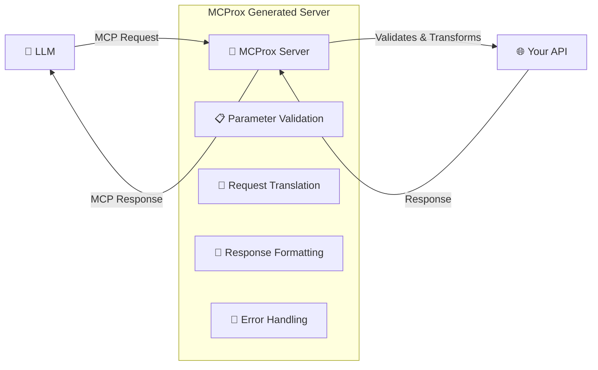

# 🚀 MCProx

[](https://golang.org)
[](https://opensource.org/licenses/MIT)
[](https://github.com/berkantay/mcprox/releases)
[](https://goreportcard.com/report/github.com/berkantay/mcprox)
[](https://github.com/berkantay/mcprox/actions)

A robust, production-ready tool that retrieves and parses OpenAPI/Swagger documentation and generates a fully functional **Model Context Protocol (MCP) proxy**. MCProx makes your existing APIs instantly accessible to LLMs without any modification to your codebase.

## 📑 Table of Contents

- [✨ Features](#-features)
- [📋 Requirements](#-requirements)
- [⚡ Quick Start](#-quick-start)
- [📖 Usage](#-usage)
  - [Basic Commands](#basic-commands)
  - [Configuration Options](#configuration-options)
  - [Real-World Examples](#real-world-examples)
- [🏗️ Architecture](#️-architecture)
- [⚙️ How It Works](#️-how-it-works)
- [📁 Generated Server](#-generated-server)
- [🌍 Environment Variables](#-environment-variables)
- [📝 Examples](#-examples)
- [🔧 Development](#-development)
  - [Prerequisites](#prerequisites)
  - [Building from Source](#building-from-source)
  - [Running Tests](#running-tests)
- [🐛 Troubleshooting](#-troubleshooting)
- [❓ FAQ](#-faq)
- [🗺️ Roadmap](#️-roadmap)
- [🤝 Contributing](#-contributing)
- [📄 License](#-license)
- [🙏 Acknowledgments](#-acknowledgments)

## ✨ Features

- **🔗 OpenAPI/Swagger Integration**: Automatically fetches and parses Swagger documentation from any URL
- **🐍 Python MCP Server Generation**: Creates a fully functional MCP server in Python using modern best practices
- **🌉 Bridge Between LLMs and APIs**: Acts as a middleware layer that translates between LLM function calls and REST API endpoints
- **🌐 Real API Integration**: Makes actual HTTP requests to the original API, supporting all HTTP methods and authentication
- **🔍 Comprehensive Parsing**: Analyzes endpoints, methods, parameters, and schemas to create a complete MCP representation
- **🏗️ Modern Python Structure**: Generates a well-structured Python project with virtual environment support
- **🚀 Production-Ready**: Built with robust error handling, logging, and configuration options
- **📚 Well-Structured**: Organized codebase following best practices for Go and Python projects
- **⚡ High Performance**: Optimized for speed and reliability with concurrent processing
- **🔐 Security First**: Built-in security features and best practices

## 📋 Requirements

- **Go**: 1.23 or higher
- **Python**: 3.8+ (for generated MCP servers)
- **Git**: For cloning and version control
- **Internet Connection**: For fetching OpenAPI specifications

### Optional Tools

- **[uv](https://github.com/astral-sh/uv)**: For faster Python dependency management (recommended)
- **[Docker](https://docker.com)**: For containerized deployments
- **[Make](https://www.gnu.org/software/make/)**: For build automation

## ⚡ Quick Start

### Installation

Choose your preferred installation method:

#### Option 1: Install via Go (Recommended)
```bash
go install github.com/berkantay/mcprox@latest
```

#### Option 2: Download Binary
Visit the [releases page](https://github.com/berkantay/mcprox/releases) and download the appropriate binary for your system.

#### Option 3: Build from Source
```bash
git clone https://github.com/berkantay/mcprox.git
cd mcprox
make build
```

### Generate Your First MCP Proxy

```bash
# Generate an MCP proxy from an OpenAPI spec
mcprox generate --url https://petstore.swagger.io/v2/swagger.json --service-url https://petstore.swagger.io/v2

# Navigate to the generated server
cd generated_mcp_server

# Set up the Python environment (using uv for speed)
./scripts/setup.sh  # or scripts/setup.bat on Windows

# Activate the environment and run the server
source .venv/bin/activate  # or .venv\Scripts\activate.bat on Windows
python -m src.mcp_server
```

Your MCP proxy is now running on `http://localhost:8000`! 🎉

## 📖 Usage

### Basic Commands

```bash
# Basic generation
mcprox generate --url <swagger-url>

# Connect to the original API service
mcprox generate --url <swagger-url> --service-url <api-base-url>

# Add authentication to API requests
mcprox generate --url <swagger-url> --service-url <api-base-url> --service-auth "Bearer token123"

# Configure the output directory
mcprox generate --url <swagger-url> --output ./my-mcp-server

# Set timeout for HTTP requests
mcprox generate --url <swagger-url> --timeout 60

# Enable debug logging
mcprox generate --url <swagger-url> --debug

# Use a configuration file
mcprox generate --config ./config.yaml
```

### Configuration Options

| Flag | Short | Default | Description |
|------|-------|---------|-------------|
| `--url` | `-u` | *required* | URL to fetch OpenAPI documentation |
| `--timeout` | `-t` | `30` | Timeout in seconds for HTTP requests |
| `--output` | `-o` | `./generated` | Output directory for generated server |
| `--service-url` | | | Base URL of your API service |
| `--service-auth` | | | Authorization header for API requests |
| `--config` | | | Config file (default is `$HOME/.mcprox.yaml`) |
| `--debug` | | `false` | Enable debug logging |

### Real-World Examples

#### Example 1: Pet Store API
```bash
# Generate MCP proxy for the famous Swagger Pet Store
mcprox generate \
  --url https://petstore.swagger.io/v2/swagger.json \
  --service-url https://petstore.swagger.io/v2 \
  --output ./petstore-mcp
```

#### Example 2: GitHub API with Authentication
```bash
# Generate MCP proxy for GitHub API with token auth
mcprox generate \
  --url https://api.github.com/swagger.json \
  --service-url https://api.github.com \
  --service-auth "Bearer ghp_your_token_here" \
  --output ./github-mcp
```

#### Example 3: Internal Company API
```bash
# Generate MCP proxy for your internal API
mcprox generate \
  --url http://internal-api.company.com/api/docs/swagger.json \
  --service-url http://internal-api.company.com \
  --service-auth "Bearer $API_TOKEN" \
  --timeout 60 \
  --output ./company-api-mcp
```

#### Example 4: Using Configuration File
Create a `config.yaml`:
```yaml
service:
  url: "https://api.example.com"
  authorization: "Bearer your-token"
timeout: 60
debug: true
```

Then run:
```bash
mcprox generate --url https://api.example.com/swagger.json --config config.yaml
```

## 🏗️ Architecture

MCProx creates a seamless bridge between LLMs and your existing APIs:



### Key Components

1. **🎯 LLM Interface**: Receives function calls from LLMs via MCP protocol
2. **✅ Parameter Validation**: Validates requests against OpenAPI specifications
3. **🔄 Request Translation**: Converts MCP function calls to HTTP requests
4. **🌐 API Communication**: Makes real HTTP requests to your original API
5. **📝 Response Formatting**: Formats API responses back to MCP format
6. **🚨 Error Handling**: Provides meaningful error messages and logging

This architecture provides:

- **🔒 Security**: Validation layer prevents malformed requests
- **🏗️ Separation of Concerns**: LLM logic separated from business logic
- **📈 Scalability**: Stateless design allows horizontal scaling
- **🔧 Maintainability**: No changes required to existing APIs

## ⚙️ How It Works

MCProx operates through a sophisticated multi-stage process:

### Stage 1: 📥 OpenAPI Discovery
```bash
mcprox generate --url https://api.example.com/swagger.json
```
- Fetches OpenAPI/Swagger specification from URL
- Validates specification format and structure
- Extracts API metadata and configuration

### Stage 2: 🔍 Schema Analysis
- **Endpoint Discovery**: Identifies all available API endpoints
- **Method Analysis**: Catalogs HTTP methods (GET, POST, PUT, DELETE, etc.)
- **Parameter Extraction**: Maps path, query, header, and body parameters
- **Schema Validation**: Analyzes request/response schemas and data types
- **Authentication Detection**: Identifies security requirements

### Stage 3: 🏭 Code Generation
Generates a complete Python MCP server including:

- **🛠️ Tool Definitions**: Each API endpoint becomes an MCP tool
- **✅ Validation Logic**: Parameter validation based on OpenAPI schemas
- **🌐 HTTP Client**: Configured client for making API requests
- **🚨 Error Handling**: Comprehensive error handling and logging
- **📊 Health Checks**: Built-in health and status endpoints

### Stage 4: 📁 Project Scaffolding
Creates a complete project structure with:
- Modern `pyproject.toml` configuration
- Virtual environment setup scripts
- Comprehensive documentation
- Testing framework setup
- Git integration

## 📁 Generated Server

The generated MCP server is a complete, production-ready Python application:

### 📂 Project Structure
```
generated_mcp_server/
├── 📄 pyproject.toml           # Modern Python project configuration
├── 📖 README.md                # Auto-generated documentation
├── 🙈 .gitignore               # Git ignore rules
├── 📁 scripts/                 # Utility scripts
│   ├── 🔧 setup.sh             # Unix environment setup
│   ├── 🔧 setup.bat            # Windows environment setup
│   └── 🚀 run.py               # Server launcher
├── 📁 src/                     # Source code
│   ├── 📝 __init__.py          # Package marker
│   └── 🌐 mcp_server.py        # MCP server implementation
├── 📁 tests/                   # Test directory
│   └── 📝 __init__.py          # Test package marker
└── 📁 .venv/                   # Virtual environment (after setup)
```

### 🌐 API Endpoints

The generated server provides:

- **📡 MCP Protocol Endpoint**: `POST /api/mcp` - Main MCP communication
- **❤️ Health Check**: `GET /health` - Service status and diagnostics
- **📊 Metrics**: `GET /metrics` - Performance and usage metrics (optional)
- **📋 OpenAPI Docs**: `GET /docs` - Generated API documentation

### 🛠️ Built-in Features

- **🔒 Request Validation**: Automatic validation using OpenAPI schemas
- **📝 Comprehensive Logging**: Structured logging with configurable levels
- **⚡ Async Support**: Non-blocking operations for better performance
- **🔄 Retry Logic**: Automatic retry with exponential backoff
- **📊 Metrics Collection**: Built-in metrics for monitoring
- **🌍 CORS Support**: Cross-origin request handling
- **🔧 Configuration Management**: Environment-based configuration

## 🌍 Environment Variables

Configure your generated MCP server with these environment variables:

| Variable | Default | Description |
|----------|---------|-------------|
| `SERVICE_URL` | `http://localhost:8080` | Base URL of the target API service |
| `SERVICE_AUTH` | | Authorization header value |
| `PORT` | `8000` | Port for the MCP server |
| `LOG_LEVEL` | `INFO` | Logging level (`DEBUG`, `INFO`, `WARN`, `ERROR`) |
| `TIMEOUT` | `30` | HTTP request timeout in seconds |
| `MAX_RETRIES` | `3` | Maximum retry attempts for failed requests |
| `CORS_ORIGINS` | `*` | Allowed CORS origins |

### 📄 Example .env File
```bash
# API Configuration
SERVICE_URL=https://api.mycompany.com
SERVICE_AUTH=Bearer your-secret-token

# Server Configuration
PORT=8080
LOG_LEVEL=DEBUG

# Performance Tuning
TIMEOUT=60
MAX_RETRIES=5

# Security
CORS_ORIGINS=https://myapp.com,https://localhost:3000
```

## 📝 Examples

### Complete Workflow Example

Let's walk through setting up an MCP proxy for a complete API:

#### 1. 🎯 Generate the Proxy
```bash
# Generate MCP proxy for JSONPlaceholder API
mcprox generate \
  --url https://jsonplaceholder.typicode.com/swagger.json \
  --service-url https://jsonplaceholder.typicode.com \
  --output ./jsonplaceholder-mcp \
  --debug
```

#### 2. 🔧 Set Up Environment
```bash
cd jsonplaceholder-mcp

# Create virtual environment (using uv for speed)
./scripts/setup.sh

# Activate environment
source .venv/bin/activate
```

#### 3. 🚀 Launch Server
```bash
# Set environment variables
export PORT=8080
export LOG_LEVEL=DEBUG

# Start the server
python -m src.mcp_server
```

#### 4. 🧪 Test the Proxy
```bash
# Health check
curl http://localhost:8080/health

# Test MCP endpoint with a sample request
curl -X POST http://localhost:8080/api/mcp \
  -H "Content-Type: application/json" \
  -d '{
    "jsonrpc": "2.0",
    "id": 1,
    "method": "tools/call",
    "params": {
      "name": "getPosts",
      "arguments": {}
    }
  }'
```

### Docker Deployment Example

Create a `Dockerfile` in your generated server:

```dockerfile
FROM python:3.11-slim

WORKDIR /app
COPY . .

RUN pip install uv && \
    uv sync && \
    uv pip install gunicorn

EXPOSE 8000
CMD ["uv", "run", "gunicorn", "-w", "4", "-b", "0.0.0.0:8000", "src.mcp_server:app"]
```

Build and run:
```bash
docker build -t my-mcp-server .
docker run -p 8000:8000 -e SERVICE_URL=https://api.example.com my-mcp-server
```

## 🔧 Development

### Prerequisites

- **Go 1.23+**: [Download Go](https://golang.org/dl/)
- **Git**: [Install Git](https://git-scm.com/downloads)
- **Make**: Usually pre-installed on Unix systems

### Building from Source

```bash
# Clone the repository
git clone https://github.com/berkantay/mcprox.git
cd mcprox

# Download dependencies
go mod download

# Build the binary
make build

# Or build for specific platforms
make build-linux
make build-windows
make build-darwin

# Install locally
make install
```

### Running Tests

```bash
# Run all tests
make test

# Run tests with coverage
make test-coverage

# Run integration tests
make test-integration

# Run linting
make lint

# Format code
make fmt
```

### Development Workflow

```bash
# Set up development environment
make dev-setup

# Run in development mode with hot reload
make dev

# Generate test data
make generate-test-data

# Clean build artifacts
make clean
```

### Project Structure

```
mcprox/
├── 📁 cmd/mcprox/              # Command-line interface
│   ├── 📄 main.go              # Application entry point
│   └── 📁 pkg/                 # CLI commands
├── 📁 internal/                # Internal packages
│   ├── 📁 config/              # Configuration management
│   ├── 📁 mcp/                 # MCP server generation
│   └── 📁 openapi/             # OpenAPI parsing
├── 📁 pkg/                     # Public packages
│   └── 📁 util/                # Utility functions
├── 📄 go.mod                   # Go module definition
├── 📄 go.sum                   # Go dependency checksums
├── 📄 Makefile                 # Build automation
└── 📄 README.md                # This file
```

## 🐛 Troubleshooting

### Common Issues and Solutions

#### Issue: `command not found: mcprox`
**Solution**: Ensure Go's bin directory is in your PATH:
```bash
echo 'export PATH=$PATH:$(go env GOPATH)/bin' >> ~/.bashrc
source ~/.bashrc
```

#### Issue: OpenAPI fetch timeout
**Solution**: Increase timeout and check connectivity:
```bash
# Increase timeout to 60 seconds
mcprox generate --url https://api.example.com/swagger.json --timeout 60

# Test connectivity
curl -I https://api.example.com/swagger.json
```

#### Issue: Generated server fails to start
**Solution**: Check Python environment and dependencies:
```bash
cd generated_mcp_server

# Verify Python version
python --version  # Should be 3.8+

# Recreate virtual environment
rm -rf .venv
./scripts/setup.sh

# Check for missing dependencies
source .venv/bin/activate
python -m pip check
```

#### Issue: API authentication errors
**Solution**: Verify authentication configuration:
```bash
# Test API access directly
curl -H "Authorization: Bearer your-token" https://api.example.com/endpoint

# Check service auth configuration
export SERVICE_AUTH="Bearer your-token"
python -m src.mcp_server
```

#### Issue: CORS errors in browser
**Solution**: Configure CORS origins:
```bash
export CORS_ORIGINS="https://yourdomain.com,http://localhost:3000"
python -m src.mcp_server
```

### Debug Mode

Enable detailed logging for troubleshooting:

```bash
# Enable debug mode during generation
mcprox generate --url https://api.example.com/swagger.json --debug

# Enable debug logging in generated server
export LOG_LEVEL=DEBUG
python -m src.mcp_server
```

### Getting Help

- 🐛 **Bug Reports**: [GitHub Issues](https://github.com/berkantay/mcprox/issues)
- 💡 **Feature Requests**: [GitHub Discussions](https://github.com/berkantay/mcprox/discussions)
- 📖 **Documentation**: [Wiki](https://github.com/berkantay/mcprox/wiki)
- 💬 **Community**: [Discord Server](https://discord.gg/mcprox)

## ❓ FAQ

### General Questions

**Q: What is the Model Context Protocol (MCP)?**
A: MCP is a protocol that enables AI/LLM applications to securely access external data and services. MCProx generates MCP-compatible servers from your existing APIs.

**Q: Do I need to modify my existing API to use MCProx?**
A: No! MCProx works with your existing API without any modifications. It acts as a proxy layer.

**Q: What OpenAPI/Swagger versions are supported?**
A: MCProx supports OpenAPI 3.0+ and Swagger 2.0 specifications.

### Technical Questions

**Q: Can I use MCProx with private/internal APIs?**
A: Yes! MCProx can generate proxies for any API with an accessible OpenAPI specification, including internal company APIs.

**Q: How does authentication work?**
A: MCProx passes through authentication headers to your original API. You can configure auth using the `--service-auth` flag or `SERVICE_AUTH` environment variable.

**Q: Is the generated server production-ready?**
A: Yes! The generated server includes proper error handling, logging, health checks, and follows production best practices.

**Q: Can I customize the generated server?**
A: The generated server is designed to be modified. You can edit the Python code to add custom logic, middleware, or additional endpoints.

### Performance Questions

**Q: How fast is MCProx?**
A: MCProx generates servers in seconds and the generated servers have minimal overhead, typically adding <10ms latency.

**Q: Can the generated server handle high load?**
A: Yes! The generated server uses async Python and can be scaled horizontally. Consider using a production WSGI server like Gunicorn or uWSGI.

**Q: Does MCProx cache API responses?**
A: By default, no. But you can easily add caching to the generated server code.

## 🗺️ Roadmap

### 🎯 Short Term (Next Release)

- [ ] **🔐 Enhanced Authentication**: Support for OAuth2, API Keys, and custom auth flows
- [ ] **📁 Local File Support**: Generate proxies from local OpenAPI files
- [ ] **🐳 Docker Templates**: Generate Dockerfiles and docker-compose configurations
- [ ] **📊 Better Metrics**: Detailed performance and usage metrics
- [ ] **🧪 Test Generation**: Auto-generate test suites for generated servers

### 🚀 Medium Term (3-6 months)

- [ ] **🌐 Multi-Language Support**: Generate servers in Go, Node.js, and Rust
- [ ] **📝 YAML Configuration**: Support for comprehensive YAML config files
- [ ] **🔄 Live Reload**: Auto-regenerate servers when OpenAPI specs change
- [ ] **📈 Performance Optimizations**: Caching, connection pooling, and async improvements
- [ ] **🎨 Custom Templates**: User-defined code generation templates

### 🎆 Long Term (6+ months)

- [ ] **🤖 AI-Powered Enhancements**: LLM-driven API optimization suggestions
- [ ] **📊 Analytics Dashboard**: Web UI for monitoring generated proxies
- [ ] **🌍 Multi-API Aggregation**: Combine multiple APIs into single MCP server
- [ ] **🔒 Advanced Security**: Rate limiting, request signing, and audit logging
- [ ] **☁️ Cloud Integration**: One-click deployment to major cloud providers

### 🎯 Community Requested

Vote for features on our [GitHub Discussions](https://github.com/berkantay/mcprox/discussions)!

- [ ] **GraphQL Support**: Generate proxies for GraphQL APIs
- [ ] **WebSocket Support**: Real-time API proxy capabilities
- [ ] **Plugin System**: Extensible architecture for custom functionality
- [ ] **IDE Extensions**: VS Code and other editor integrations

## 🤝 Contributing

We welcome contributions from the community! Here's how you can help:

### 🚀 Quick Start for Contributors

```bash
# Fork the repository on GitHub
git clone https://github.com/yourusername/mcprox.git
cd mcprox

# Set up development environment
make dev-setup

# Create a feature branch
git checkout -b feature/amazing-feature

# Make your changes and test
make test

# Submit a pull request
```

### 📋 Contribution Guidelines

- **🐛 Bug Reports**: Use the issue templates and provide detailed reproduction steps
- **✨ Feature Requests**: Discuss new features in GitHub Discussions first
- **📝 Code Changes**: Follow the existing code style and include tests
- **📖 Documentation**: Help improve documentation and examples
- **🌍 Translations**: Contribute translations for different languages

### 🔧 Development Guidelines

- Write clear, self-documenting code
- Include unit tests for new features
- Update documentation for API changes
- Follow [Conventional Commits](https://conventionalcommits.org/)
- Ensure all CI checks pass

### 🎯 Good First Issues

Look for issues labeled [`good first issue`](https://github.com/berkantay/mcprox/labels/good%20first%20issue) to get started!

### 🏆 Contributors

Thanks to all our contributors! 🎉

<a href="https://github.com/berkantay/mcprox/graphs/contributors">
  
</a>

## 📄 License

This project is licensed under the **MIT License** - see the [LICENSE](LICENSE) file for details.

```
MIT License

Copyright (c) 2023 berkantay

Permission is hereby granted, free of charge, to any person obtaining a copy
of this software and associated documentation files (the "Software"), to deal
in the Software without restriction, including without limitation the rights
to use, copy, modify, merge, publish, distribute, sublicense, and/or sell
copies of the Software, and to permit persons to whom the Software is
furnished to do so, subject to the following conditions:

The above copyright notice and this permission notice shall be included in all
copies or substantial portions of the Software.

THE SOFTWARE IS PROVIDED "AS IS", WITHOUT WARRANTY OF ANY KIND, EXPRESS OR
IMPLIED, INCLUDING BUT NOT LIMITED TO THE WARRANTIES OF MERCHANTABILITY,
FITNESS FOR A PARTICULAR PURPOSE AND NONINFRINGEMENT. IN NO EVENT SHALL THE
AUTHORS OR COPYRIGHT HOLDERS BE LIABLE FOR ANY CLAIM, DAMAGES OR OTHER
LIABILITY, WHETHER IN AN ACTION OF CONTRACT, TORT OR OTHERWISE, ARISING FROM,
OUT OF OR IN CONNECTION WITH THE SOFTWARE OR THE USE OR OTHER DEALINGS IN THE
SOFTWARE.
```

## 🙏 Acknowledgments

- **[OpenAPI Initiative](https://www.openapis.org/)** for the OpenAPI specification
- **[Model Context Protocol](https://modelcontextprotocol.io/)** for the MCP standard
- **[mark3labs/mcp-go](https://github.com/mark3labs/mcp-go)** for the Go MCP library
- **[getkin/kin-openapi](https://github.com/getkin/kin-openapi)** for OpenAPI parsing
- **[spf13/cobra](https://github.com/spf13/cobra)** for CLI framework
- **[gofiber/fiber](https://github.com/gofiber/fiber)** for the web framework

### 🌟 Special Thanks

- All contributors who have helped improve MCProx
- The OpenAPI and MCP communities for their valuable feedback
- Users who have reported issues and suggested improvements

---

<div align="center">

**⭐ If MCProx helps you, please star this repository! ⭐**

Made with ❤️ by [berkantay](https://github.com/berkantay) and the [MCProx community](https://github.com/berkantay/mcprox/graphs/contributors)

[🏠 Website](https://berkantay.github.io/mcprox) • [📖 Documentation](https://github.com/berkantay/mcprox/wiki) • [🐛 Report Bug](https://github.com/berkantay/mcprox/issues) • [✨ Request Feature](https://github.com/berkantay/mcprox/discussions)

</div>